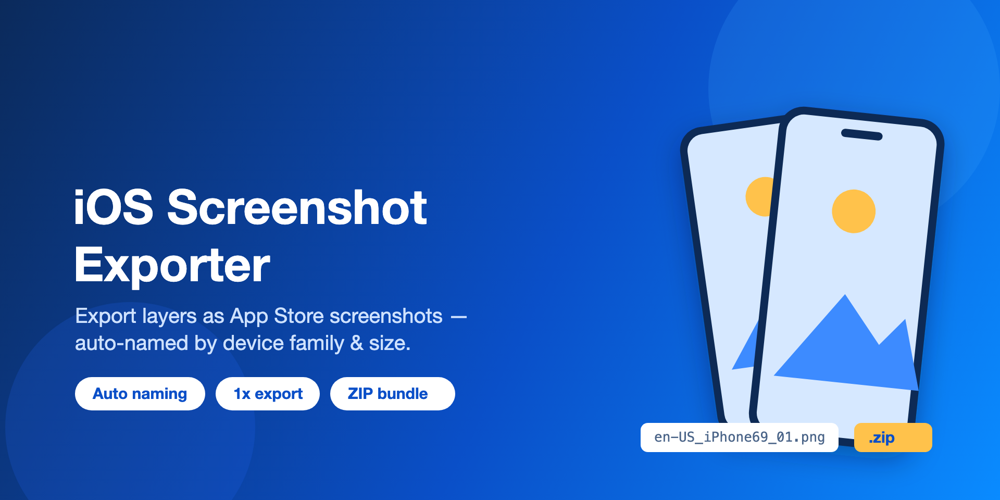

# iOS Screenshot Exporter



A Figma plugin that exports selected layers as App Store screenshots, automatically named by **device family + screen size** so they're ready to upload to App Store Connect.

It reads each layer's exported pixel size, matches it against the known App Store Connect display sizes, and produces files like:

```
en-US_iPhone69_01_Home.png
en-US_iPhone69_02_Library.png
en-US_iPad13_01_Home.png
```

When more than one file is produced, they are bundled into a single `screenshots.zip`.

## Features

- **Exports selected layers as-is** — any exportable node type, not just frames. With nothing selected, it falls back to all layers directly on the page.
- **Automatic device-family naming** — the exported resolution is matched to App Store Connect display families (e.g. `iPhone69`, `iPad13`). Orientation is normalized to portrait before matching.
- **Reading-order sequence numbers** — layers are ordered top→bottom, left→right (via row clustering), and the sequence counter resets per device family.
- **Configurable file names** — optional locale prefix, optional layer name, custom separator, and zero-padding width.
- **PNG or JPG**, always exported at **1x**.
- **Localized UI (English / Japanese)** — auto-detected from the editor language with a manual switcher.
- **Graceful fallback** — layers whose size doesn't match a known family are exported with an `UNKNOWN{w}x{h}` label and reported as a warning.

## Naming format

```
[locale_]<family><sep><seq>[<sep><layerName>].<ext>
```

| Part        | Source                              | Example     |
| ----------- | ----------------------------------- | ----------- |
| `locale`    | "Locale" field (prefix, optional)   | `en-US`     |
| `family`    | Resolved from exported size         | `iPhone69`  |
| `seq`       | Reading order, per family, zero-pad | `01`        |
| `layerName` | Layer name (optional)               | `Home`      |
| `sep`       | Separator field                     | `_`         |

## Supported sizes

Exported pixel sizes (portrait) are matched to these families:

- **iPhone** — `iPhone69`, `iPhone65`, `iPhone63`, `iPhone61`, `iPhone55`, `iPhone47`
- **iPad** — `iPad13`, `iPad11`, `iPad105`, `iPad97`

The full size→label table lives in [`SIZE_LABELS`](code.ts). Because export is always 1x, the source layers must already be at the native screenshot resolution to match a family; otherwise they fall back to an `UNKNOWN…` label.

## Installation (local)

This plugin isn't published to the Figma Community, so install it as a local development plugin. You need the **Figma desktop app** (importing a manifest isn't available in the browser) and **Node.js**.

1. Clone the repository:

2. Install dependencies:

   ```sh
   npm install
   ```

3. Build `code.js` (it is git-ignored, so you must build before importing):

   ```sh
   npm run build
   ```

4. In the Figma desktop app, open any file and go to **Menu → Plugins → Development → Import plugin from manifest…**, then select this repo's `manifest.json`.

5. Run it anytime via **Menu → Plugins → Development → iOS Screenshot Exporter**.

> To keep editing the source, run `npm run watch` so `code.js` rebuilds on save, then use **Plugins → Development → Hot reload plugin** (or re-run the plugin) to pick up changes.

## Usage

1. In Figma, open the plugin.
2. Select the layers you want to export (or select nothing to use every layer on the page).
3. Adjust options: UI language, locale prefix, include layer name, separator, zero-pad digits, format (PNG/JPG), and row-grouping tolerance.
4. Click **Export**. A single file downloads directly; multiple files download as `screenshots.zip`.

## Project structure

| File            | Role                                                              |
| --------------- | ---------------------------------------------------------------- |
| `code.ts`       | Plugin main thread — collection, ordering, naming, export logic. |
| `code.js`       | Compiled output of `code.ts` (generated; do not edit directly).  |
| `ui.html`       | Plugin UI, including the i18n string dictionary and ZIP packing. |
| `manifest.json` | Figma plugin manifest.                                           |

## Development

Install dependencies and the Figma type definitions:

```sh
npm install
```

Build `code.js` from `code.ts`:

```sh
npm run build      # one-off compile
npm run watch      # recompile on save
```

Then load the plugin in Figma via **Plugins → Development → Import plugin from manifest…** and select `manifest.json`.

### Adding a UI language

The UI strings live in the `I18N` dictionary in [`ui.html`](ui.html). Add a new entry (e.g. `zh`) alongside `ja`/`en` and add a matching `<option>` to the `#lang` selector.

### Bundled JSZip (no network access)

[JSZip](https://stuk.github.io/jszip/) is bundled (inlined) into `ui.html`, so the
plugin declares **no network access** in `manifest.json`. The source is kept at
`vendor/jszip.min.js`; to update it, run:

```sh
npm run vendor:jszip
```

JSZip is used under the MIT license — see [THIRD_PARTY_LICENSES.md](THIRD_PARTY_LICENSES.md).
This project itself is MIT licensed — see [LICENSE](LICENSE).
